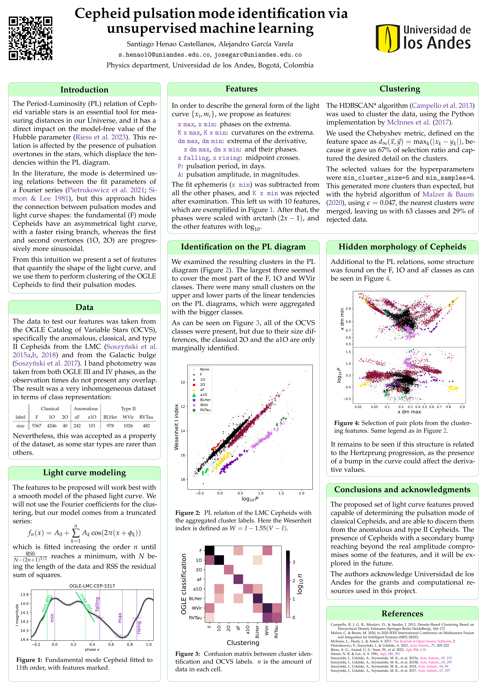

# LARIM 2023 poster

Here is the code for my poster contribution "Cepheid pulsation mode identification via unsupervised machine learning" on the XVII Latin American Regional IAU Meeting,
preseented on Montevideo, Uruguay 27th November 2023.

([pdf version](./poster.pdf))

I used the following external code:

* The citation file `aa_url.bst` was taken from [yangcht's repository](https://github.com/yangcht/AA-bibstyle-with-hyperlink).
* The `baposter.cls` class from [Brian Amberg's LaTeX Poster Template](https://github.com/mloesch/baposter).

